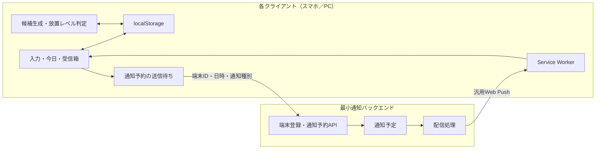
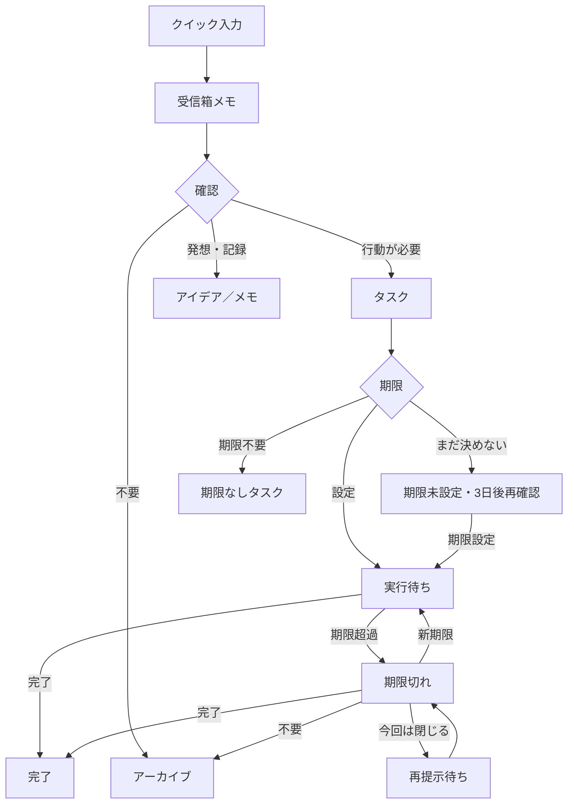

# あとキュー（仮称）MVP設計

| 項目     | 内容                               |
| -------- | ---------------------------------- |
| 作成日   | 2026-08-03                         |
| 状態     | 設計承認済み・未実装               |
| 対象     | 個人利用向けPWAのMVP               |
| 保存方式 | 端末ごとのlocalStorage             |
| 通知方式 | 最小通知バックエンドからのWeb Push |

## 1. 概要

「あとキュー」は、仕事中や日常生活で突然浮かんだ用事・気づき・アイデアを、現在の行動を大きく中断せず退避し、あとから確実に整理・処理できるようにする個人向けPWAである。

MVPの価値は次の連続した体験にある。

1. 思いついた内容を数秒で保存する
2. 保存時には分類や期限を要求しない
3. 後の確認時に、タスク・アイデア・不要を判断する
4. タスクには期限設定を促す
5. 放置度に応じた声掛けで、完了・再設定・不要のいずれかへ導く

単なるメモアプリや通知アプリではなく、「入力時は徹底して軽く、サジェスト時は判断を曖昧に残さない」ことを設計の中心とする。

## 2. 設計原則

### 2.1 入力と整理を分離する

クイック入力では一文だけを受け取り、保存後はすぐ元の作業へ戻れるようにする。期限、カテゴリ、優先度、タスクか否かは入力時に質問しない。

### 2.2 自動タスク化は候補に留める

ルールベース解析がタスク名、期限、カテゴリの候補を作るが、自動では確定しない。利用者がタスク、アイデア／記録、不要のいずれかを選ぶ。

### 2.3 声掛けは強くしても責めない

放置が進むほど判断を具体的に促すが、罪悪感を与える文面は使わない。強さは攻撃的な語調ではなく、経過事実の明示と選択肢の絞り込みで表現する。

### 2.4 タスクは黙って消さない

期限切れタスクは、完了、新期限の設定、不要のいずれかが確定するまで保持する。「今回は閉じる」は許可するが、状態は未処理のままとし、後日再提示する。

### 2.5 通知がなくても主要フローを完走できる

通知拒否、OS制約、オフライン、通知サーバー停止があっても、アプリを開けば「今日の確認」から同じ判断を行える。

## 3. MVPの範囲

### 3.1 含めるもの

- スマホ・PCへインストール可能なPWA
- 一文のクイック入力
- localStorageへの端末内保存
- オフラインでの入力・閲覧・整理
- 未整理メモの受信箱
- ルールベースのタスク候補生成
- タスク／アイデア／不要の確認
- 期限設定と期限未設定の再確認
- 放置レベルに応じた声掛け
- 今日の確認を1件ずつ進めるフロー
- 期限切れタスクの完了・再設定・不要処理
- 最小通知バックエンドによるWeb Push
- JSON形式のバックアップと復元
- 完了後を含むタスク状態の修正
- 変更履歴の端末内保存

### 3.2 含めないもの

- アカウント管理
- スマホとPCのデータ同期
- クラウドDBへのタスク本文保存
- チーム共有や他者への割り当て
- AI APIによる文章解析
- 外部カレンダー連携
- 音声入力
- 位置情報に基づく通知

MVPではスマホとPCの両方で利用できるが、各端末の受信箱、タスク、履歴、通知予約は独立する。

## 4. システム構成

### 4.1 PWAクライアント

クライアントは次の責務を持つ。

- 入力、確認、編集画面を提供する
- タスク本文と状態をlocalStorageへ保存する
- 保存メモからタスク候補を作る
- 期限、経過時間、反応履歴から放置レベルを判定する
- 次回通知日時を計算する
- 通知バックエンドへの登録、変更、取消を送信する
- Web Pushを受信し、汎用通知を表示する
- 通知タップ後に最新のローカル状態を再確認する

### 4.2 最小通知バックエンド

バックエンドは次の責務だけを持つ。

- 端末ごとのPush購読情報を登録する
- 通知予定を登録、変更、取消する
- 予定時刻にWeb Pushを送信する
- 無効になった購読情報を停止する

バックエンドにはタスク本文を保存しない。通知本文は「確認が必要なタスクがあります」などの汎用文とし、具体的なタスク名と声掛けはPWAを開いた後に表示する。

### 4.3 複数クライアント

各インストールは固有の端末IDとPush購読情報を持つ。スマホで作成したタスクはスマホだけに保存され、PCで作成したタスクはPCだけに保存される。一方の端末での完了や変更は、他方へ反映しない。

将来の同期版では、アカウント、クラウドDB、端末一覧、同期競合処理を追加する。MVPの通知APIは、将来 `user -> devices -> subscriptions` の関係へ拡張できるよう、端末単位の登録を前提とする。

## 5. 状態モデル

### 5.1 状態の意味

| 状態           | 意味                                     |
| -------------- | ---------------------------------------- |
| 受信箱メモ     | 保存済みだが、タスクか否かを未確認       |
| アイデア／メモ | 行動や期限を要求しない記録               |
| 実行待ち       | タスクとして確定し、期限が設定されている |
| 期限未設定     | タスクだが期限を決めておらず、再確認対象 |
| 期限なしタスク | 利用者が期限不要と明示したタスク         |
| 期限切れ       | 期限を過ぎ、完了が確認されていない       |
| 完了           | 実行済み。後から取消可能                 |
| アーカイブ     | 不要または保管扱い。後から戻せる         |

状態変更はすべて操作履歴へ記録する。通知を閉じただけでは、タスク状態を変更しない。

## 6. 放置レベルと声掛け

放置レベルはAIではなく、期限まで／期限超過からの経過時間、登録からの経過時間、アプリ内で「今回は閉じる」を選んだ回数、期限を延期した回数から決定する。

OS通知を閉じたことは端末やブラウザ間で一貫して取得できないため、放置回数には含めない。PWA内で行われた明示的な操作だけを履歴に使う。

| レベル      | 主な条件                              | 声掛け例                                         | 主な選択肢                                   |
| ----------- | ------------------------------------- | ------------------------------------------------ | -------------------------------------------- |
| 0：通常     | 期限まで余裕がある                    | 「予定があります」                               | 完了、今日やる、期限変更                     |
| 1：確認     | 期限当日、または期限未設定の再確認日  | 「今日が期限です。どうしますか？」               | 完了、今日やる、期限変更、不要               |
| 2：放置気味 | 1〜3日超過、またはアプリ内で1回閉じた | 「期限を2日過ぎています。状態を更新しましょう」  | 完了、今日やる、期限変更、不要、今回は閉じる |
| 3：要整理   | 4〜7日超過、または2回以上閉じた       | 「このタスクを残すか決めましょう」               | 完了、新期限、不要、今回は閉じる             |
| 4：長期放置 | 8日以上超過、または延期・無反応が継続 | 「長く保留されています。状態を整理してください」 | 完了、新期限、不要、今回は閉じる             |

複数条件に該当する場合は、最も強いレベルを採用する。各レベルには3〜5種類の文面を用意し、同じ文面が連続しないようにする。ただし、次の文面ルールは固定する。

- 利用者を責めない
- 経過日数などの事実を示す
- 一度に一つの判断を求める
- 具体的な選択肢を表示する
- 強さは語気ではなく判断の明確さで表現する

### 6.1 期限未設定

タスク確定時に期限がなければ、今日、明日、今週中、日時を選ぶ、まだ決めない、期限なしでよい、を表示する。

「まだ決めない」を選ぶと、3日後に再確認する。再び「まだ決めない」を選んだ場合も3日後を基本とする。3回以上連続した場合は、過剰な通知を避けるため週1回へ間隔を広げ、レベル3の文面で期限を決めるか期限不要にするかを促す。

「期限なしでよい」を選んだタスクには、期限設定の再確認を行わない。ただし、利用者が一覧から期限を追加することはできる。

### 6.2 期限切れ

期限切れ画面では次を表示する。

- 完了した
- 今日やる
- 新しい期限を決める
- もう不要
- 今回は閉じる

「今回は閉じる」を選んだ後の再提示は、最初が1日後、次が3日後、その次が7日後、それ以降は7日ごととする。タスクは完了、新期限、不要のいずれかになるまで保持する。

## 7. 主要画面と操作

### 7.1 クイック入力

- 起動直後に入力欄へフォーカスする
- 一文を入力して保存できる
- PCではEnterで保存、Shift+Enterで改行する
- スマホでは保存ボタンを主操作とする
- 保存完了を短く表示し、すぐ閉じられる
- 入力時に分類、期限、優先度を求めない
- 入力途中で閉じた場合の文章は下書きとして端末内に保持する

### 7.2 今日の確認

- 対象タスクを1件ずつカードで表示する
- 上部に `現在位置 / 全件数` と進捗を表示する
- 選択を保存すると、同じ画面内で次のカードへ進む
- ページ全体の遷移は行わない
- 日付選択が必要な時だけ、その場に日付選択UIを表示する
- 2件目以降では左上に「← 前のタスク」を表示する
- 「今日の確認」という見出しは、左右のボタン幅に影響されず画面全体の中央に配置する
- 前のタスクへ戻ると、以前の選択を選択済み状態で表示し、変更できる
- 最初のタスクでは「前のタスク」を表示しない
- 途中で閉じても、回答済みの内容を保持し、未回答から再開する

選択直後の自動的な「元に戻す」表示は設けない。戻る操作を一つに絞る。

### 7.3 確認完了

全件確認後は、完了、期限設定、再確認などの件数と処理結果一覧を表示する。各行からタスクを開き、状態、期限、次回確認日を修正できる。

結果画面を閉じた後も、「今日」画面またはタスク一覧から同じ修正を行える。完了を取り消した場合は実行待ちへ戻し、必要に応じて通知を再予約する。

### 7.4 受信箱

- 未整理メモを新しい順に表示する
- 1件ずつ整理する操作を提供する
- タスク、アイデア／メモ、不要を選べる
- 元の入力文は、タスクへ変換した後も保持する

### 7.5 基本ナビゲーション

主な入口は「入力」「今日」「受信箱」とする。「今日」から今日のタスク、確認が必要なタスク、すべてのタスクへ移動できる。完了済みとアーカイブ済みもフィルターで開き、状態を修正できる。

## 8. 通知の流れ

1. 利用者が期限または次回確認日を設定する
2. クライアントが次回通知日時と汎用通知種別を計算する
3. ローカルの送信待ちへ通知予約を保存する
4. オンラインならバックエンドへ予約を送信する
5. バックエンドが予定時刻にWeb Pushを送る
6. Service Workerが汎用的なOS通知を表示する
7. 通知タップでPWAの確認画面を開く
8. PWAがlocalStorageの最新状態から表示対象と放置レベルを再計算する
9. 利用者の選択に応じ、古い通知を取消し、新しい通知を予約する

通知許可は初回画面で突然要求しない。最初の保存が成功し、価値を説明できる場面または設定画面から、利用者の明示操作で要求する。

通知の正確な配信時刻はOS、ブラウザ、集中モード、省電力、通信状態の影響を受けるため保証しない。通知が遅延しても、PWAを開いた時点の最新状態に基づいて表示内容を決定する。

## 9. データ設計

### 9.1 端末内データ

localStorageには、JSONとして次のまとまりを保存する。すべてにスキーマバージョンを持たせ、将来の形式変更時に移行できるようにする。

| データ             | 主な内容                                                         |
| ------------------ | ---------------------------------------------------------------- |
| device             | 端末ID、作成日時、Push登録状態                                   |
| settings           | 見直し時刻、通知設定、文面履歴、スキーマバージョン               |
| captures           | 元の入力文、入力日時、下書き、整理状態                           |
| tasks              | タイトル、元メモID、状態、期限、次回確認日、放置レベル、更新日時 |
| reviewSessions     | 対象タスクID、現在位置、開始・完了日時                           |
| actionHistory      | 完了、取消、期限変更、不要、再確認などの操作履歴                 |
| notificationOutbox | 通知の登録・変更・取消の未送信操作                               |
| reminderMap        | ローカルタスクとバックエンドの不透明なリマインダーIDの対応       |

各レコードIDは端末内で衝突しないUUID形式とする。実装フレームワークはこの設計では固定しないが、保存処理とUIを分離し、将来localStorageからIndexedDBや同期DBへ移行できる境界を設ける。

### 9.2 通知バックエンドのデータ

| データ             | 主な内容                                                 |
| ------------------ | -------------------------------------------------------- |
| DeviceSubscription | 端末ID、Push購読情報、作成・更新日時、有効状態           |
| ReminderJob        | 不透明なリマインダーID、端末ID、配信日時、通知種別、状態 |

タスク本文、カテゴリ、詳細な操作履歴はバックエンドへ送らない。リマインダーIDからタスク本文を推測できない値を使用する。

## 10. バックアップと復元

設定画面から端末内データをJSONファイルとして書き出せる。書き出し対象は、元メモ、タスク、履歴、設定、端末内の通知対応情報とする。ただしPush購読情報とバックエンドの有効な予約は移行せず、復元後の端末で再登録する。

復元時は次の順序で検証する。

1. JSONとして読み取れるか
2. 対応するバックアップ形式か
3. 必須項目とデータ型が正しいか
4. レコードIDが重複していないか
5. 日付と状態値が有効か

検証に失敗した場合は現在のデータを一切変更しない。成功した場合は、「現在のデータを残して復元を中止する」または「現在のデータをバックアップで置き換える」を確認してから反映する。MVPではデータ統合を行わない。

バックアップには個人的なタスク本文が平文で含まれる。MVPでは暗号化を行わず、書き出し時に取扱注意を表示する。パスフレーズ暗号化は将来機能とする。

## 11. エラー処理

| 状況               | 動作                                                       |
| ------------------ | ---------------------------------------------------------- |
| 通知を拒否         | アプリ内確認を継続し、設定から再設定できるようにする       |
| オフライン         | 入力と状態変更は成功させ、通知操作を送信待ちへ保存する     |
| 通知API失敗        | ローカル状態を戻さず、再試行対象として表示する             |
| 通知サーバー停止   | 送信待ちを保持し、次回起動・オンライン復帰時に再試行する   |
| Push購読失効       | バックエンドが無効化し、クライアントで再登録を案内する     |
| 古い通知をタップ   | 最新状態を確認し、完了済みなら処理済みと表示する           |
| 確認途中で終了     | 回答済みを保持し、未回答から再開する                       |
| 保存容量不足       | 保存失敗を明示し、バックアップと不要データ整理を案内する   |
| 壊れたバックアップ | 現在データを変更せず、読み込めない理由を表示する           |
| 対応外ブラウザ     | 利用可能な範囲を案内し、通知なしのアプリ内確認へ切り替える |

タスクの保存と通知予約は別処理とする。通知予約に失敗してもタスク保存を失敗扱いにせず、「タスクは保存済み、通知は再試行中」と明確に表示する。

## 12. セキュリティとプライバシー

- PWAと通知APIはHTTPSで提供する
- AIやPushサービスの秘密鍵をクライアントへ埋め込まない
- タスク本文を通知バックエンドへ送らない
- Push購読情報を機密データとして保護する
- 通知予約APIに入力検証、レート制限、端末単位の取消権限を設ける
- OS通知には具体的なタスク名を表示しない
- JSONバックアップが個人情報を含むことを明示する
- 通知権限を利用者の操作なしに要求しない

## 13. テスト方針

### 13.1 単体テスト

- メモからの候補生成
- 日付表現の解析
- 放置レベルの判定
- 期限未設定の3日後計算
- 期限切れの1日、3日、7日、週次再提示計算
- 状態変更と操作履歴の記録
- 通知予約の作成、変更、取消
- バックアップの検証と形式移行

### 13.2 結合テスト

- 保存から受信箱表示まで
- タスク確定から期限設定・通知予約まで
- 複数タスクの確認、前のタスクへの移動、回答変更
- 全件確認後の修正と通知再予約
- オフライン操作からオンライン復帰後の予約送信
- 古い通知を開いた場合の最新状態確認
- バックアップ書き出しと別状態への復元

### 13.3 E2Eテスト

- PWAのインストールと起動
- 入力、整理、期限設定、期限切れ処理の主要フロー
- 通知許可あり／なしの両方
- スマホ相当とPC相当の画面幅
- アプリ中断後の確認再開
- 完了取消後のタスク復帰

実機確認は少なくともiOSのホーム画面Webアプリ、Androidの対応ブラウザ、WindowsまたはmacOSの対応ブラウザで行う。OS通知の時刻精度そのものを合格条件にはせず、通知が遅延した場合も最新状態を正しく表示できることを確認する。

## 14. MVP成功基準

7日間の個人利用で次を確認する。

- 思いついてから保存まで、入力時間を含め概ね10秒以内である
- 入力時に期限や分類を要求されず、元の作業へ戻れる
- サジェスト対象を、完了、新期限、不要のいずれかへ整理できる
- 期限切れタスクが黙って消えない
- 通知が使えない場合も、アプリ内だけで主要フローを完了できる
- 声掛けが責める印象を与えず、次の行動を選びやすい
- アプリ再起動、オフライン操作、確認中断で保存済みデータを失わない
- バックアップから元メモ、タスク、状態、履歴、設定を復元できる

ここでいう「タスクを処理できた」は、必ず完了したことだけを意味しない。完了、新期限の設定、不要の確定のいずれかにより、曖昧な放置状態を解消したことを意味する。

## 15. 決定事項

| 項目         | 決定                                           |
| ------------ | ---------------------------------------------- |
| 名称         | 「あとキュー」を仮称として使用                 |
| 提供形態     | スマホ・PCへインストール可能なPWA              |
| MVP保存      | 端末ごとのlocalStorage                         |
| 複数端末     | 利用可能だがデータは同期しない                 |
| 入力         | 一文だけ。分類と期限は後回し                   |
| タスク化     | 自動確定せず候補を確認する                     |
| 放置判定     | 段階式ルール＋複数文面テンプレート             |
| 放置指標     | 時間、期限超過、アプリ内で閉じた回数、延期回数 |
| 期限未設定   | 「まだ決めない」の3日後に再確認                |
| 期限切れ     | 完了、新期限、不要が確定するまで保持           |
| 声掛け       | 放置に応じて端的にするが責めない               |
| 通知         | 最小バックエンドから汎用Web Push               |
| 通知内容     | OS上は汎用文、具体的内容はPWA内                |
| 今日の確認   | 1件ずつ処理し、自動で次へ進む                  |
| 戻る操作     | 「← 前のタスク」のみ。自動取消表示は使わない   |
| 見出し       | 「今日の確認」は画面全体の中央に配置           |
| 後からの修正 | 確認完了後も一覧から状態・期限を修正可能       |
| 履歴         | 現在状態に加えて変更履歴を端末内保存           |
| バックアップ | JSONの書き出し・読み込みをMVPに含める          |

## 16. 実装計画への引継ぎ

実装計画では、次の順序で分割する。

1. PWAの基本構成とlocalStorage保存層
2. クイック入力、受信箱、タスク状態モデル
3. 今日の確認と修正フロー
4. 放置レベル判定と文面テンプレート
5. 通知予約のローカル送信待ち
6. 最小通知バックエンドとWeb Push
7. JSONバックアップ／復元
8. オフライン、障害、実機検証

具体的なフロントエンドフレームワーク、ホスティング先、通知バックエンドの実行基盤は、上記の責務分離とプライバシー要件を満たす選択肢から実装計画で決定する。
