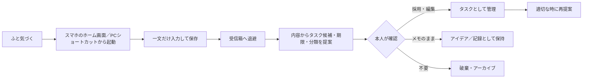

# 構想たたき台: あとキュー（仮称） — 思いつきを逃さず、あとで行動に戻すPWA

| 作成日     | 作成者 | 状態                             | 名称                                                 |
| ---------- | ------ | -------------------------------- | ---------------------------------------------------- |
| 2026-08-03 |        | 構想段階（フィードバック募集中） | 【想定】あとキュー（仮称。正式名称は要件定義で確定） |

> ⚠ この資料は思いつき段階のたたき台です。【想定】は作成者の仮置き、【要確認】は未確定事項を示します。  
> 「あとキュー」は議論のための仮称です。「あとで扱うキュー」と、適切な時に行動のきっかけ（cue）を出す役割を表しています。

## 1. 一言でいうと

作業中や日常生活で浮かんだ用事・気づき・アイデアを、スマホやPCから数秒で退避できる個人向けPWAです。保存したメモをあとから解析し、「いつ・何をすればよいか」というタスク候補に変換して、適切なタイミングで提案します。

## 2. 背景・課題

仕事に集中している最中でも、「別件のアイデアを思いついた」「猫の餌を買う必要がある」「冷蔵庫の食材の賞味期限が近い」といった、今すぐ取り組む必要はないものの忘れたくない情報が突然浮かびます。

その場で別のタスク管理アプリを開き、分類・期限・優先度まで入力しようとすると、現在の作業への集中が切れます。一方で「あとで登録しよう」と考えるだけでは、思いつき自体を忘れて後悔します。通常のメモアプリへ残しても、見返されず、行動につながらないことがあります。

必要なのは高機能なタスク管理を最初から行うことではなく、次の2段階を分ける仕組みです。

1. **今は数秒で逃がす**：入力時に整理を要求しない
2. **あとで行動に戻す**：内容を整理し、タスク候補や確認時期を提案する

## 3. 提案するアイデア

「あとキュー」は、入力時の負担を極力減らした受信箱と、あとから整理する提案画面を持ちます。

### MVPのコア体験

- スマホではホーム画面、PCではデスクトップ・タスクバー等のショートカットからPWAを起動する
- 起動直後から入力欄へカーソルが入り、一文入力してEnterまたは保存ボタンで退避できる
- 保存完了を短く表示し、そのまま閉じてもデータが失われない
- 入力した内容は端末内のlocalStorageに保存し、オフラインでも使える
- 受信箱の内容から「タスク名・期限・カテゴリ」の候補を生成する
- 自動生成した内容を勝手に確定せず、本人が採用・編集・メモのまま保持・破棄を選べる
- 未整理のメモや期限の近いタスクを、アプリを開いた時や設定した見直し時刻にサジェストする

### 入力例と提案例

| 入力した一文                             | あとキューからの提案                                 |
| ---------------------------------------- | ---------------------------------------------------- |
| 猫の餌が残り少ない                       | 「猫の餌を買う」／カテゴリ: 買い物／期限: 【要確認】 |
| 豆腐の賞味期限が明日                     | 「豆腐を使う、または状態を確認する」／期限: 明日     |
| 会議資料に比較表を入れると分かりやすそう | 「会議資料へ比較表を追加する」／カテゴリ: 仕事       |
| 旅行先で使えそうなアプリを思いついた     | タスク化せず「アイデア」として保持する候補も提示     |

## 4. 想定ユーザーと利用シーン

### 想定ユーザー

【想定】仕事と私生活の両方で複数のことを並行しており、思いつきを忘れたくない個人。最初は自分専用の利用を想定し、チーム共有や他者への割り当ては扱いません。

### 利用シーンA：仕事中の割り込み

資料作成中に、別プロジェクトの改善案を思いつきます。PCのショートカットから「あとキュー」を開き、一文だけ入力して保存します。分類はその場で行わず、すぐ資料作成へ戻ります。休憩時に受信箱を開くと、仕事カテゴリのタスク候補が表示されます。

### 利用シーンB：家庭内の気づき

朝、猫の餌が少ないことに気づきます。スマホのホーム画面から起動して「猫の餌があと2日分」と保存します。夕方の見直し時に「今日の買い物に追加しますか？」と提案され、採用すると買い物タスクになります。

## 5. 主要機能の候補

| 機能                     | 概要                                           | 優先度（ラフ）    |
| ------------------------ | ---------------------------------------------- | ----------------- |
| クイックキャプチャ       | 起動直後に一文を入力し、最小操作で保存         | 核                |
| ローカル保存             | メモ、タスク、設定をlocalStorageへ保持         | 核                |
| PWA対応                  | スマホのホーム画面、PCのショートカットから起動 | 核                |
| オフライン利用           | ネット接続がなくても入力・閲覧できる           | 核                |
| 受信箱                   | 未整理のメモを一覧し、処理待ちを見失わない     | 核                |
| タスク候補生成           | メモから行動、期限、カテゴリを抽出して候補表示 | 核                |
| 確認・編集フロー         | 候補の採用、修正、メモ保持、破棄を選択         | 核                |
| 今日のサジェスト         | 期限、未整理期間、カテゴリ等から確認候補を表示 | 核                |
| 完了・アーカイブ         | 終わったものと保留中のものを区別               | 核                |
| 通知                     | 設定時刻や期限に端末通知を出す                 | あれば            |
| 音声入力                 | 手が離せない時に声で退避する                   | あれば            |
| 検索・タグ               | 過去のメモやアイデアを探す                     | あれば            |
| エクスポート／インポート | JSON等でバックアップ・端末移行                 | あれば（MVP後半） |
| アカウント・同期         | スマホとPCで同じデータを共有                   | 将来              |
| クラウドDB               | ユーザーごとに安全にデータを保存               | 将来              |
| 外部カレンダー連携       | 期限付きタスクを予定へ反映                     | 将来              |

## 6. 実現方式の選択肢

| 案                                             | 概要                                                              | 良い点                                               | 気になる点                                                                | ざっくり規模感       |
| ---------------------------------------------- | ----------------------------------------------------------------- | ---------------------------------------------------- | ------------------------------------------------------------------------- | -------------------- |
| 松：アカウント・クラウド同期・AIを含むフル開発 | PWA、認証、クラウドDB、端末間同期、AI解析、通知まで一体で構築     | 最初からスマホとPCで同じデータを使える。将来像に近い | 認証、同期競合、セキュリティ、運用費の検討が必要。検証前の投資が大きい    | 【想定】2〜4か月以上 |
| 竹：local-first PWA＋限定的な解析API           | 保存の主軸はlocalStorage。必要な時だけ安全な中継APIを通してAI解析 | MVPの軽さを保ちながら、高品質な候補生成を試せる      | 入力内容が外部へ送られる場合の同意とプライバシー設計が必要。API費用が発生 | 【想定】3〜6週間     |
| 梅：端末内完結のPWA                            | localStorageとルールベース解析で、日付・カテゴリ・行動語を抽出    | 低コストで早く作れ、オフライン・プライバシー面に強い | 自由文の理解力には限界がある。端末間同期はできない                        | 【想定】1〜3週間     |

### 現時点の推奨

まずは**梅案**で、「本当に数秒で残せるか」「あとからの提案が役に立つか」を検証します。候補生成の精度が価値のボトルネックだと分かった時点で竹案へ進み、継続利用が確認できたら松案のアカウント・同期基盤を検討します。

ブラウザへAIサービスの秘密鍵を直接埋め込む方式は採用しません。AI解析を追加する場合は、秘密鍵を保護できる中継APIを用意します。

## 7. 期待効果とリスク・懸念

### 期待効果

- 【想定】思いつきの退避を5〜10秒程度で終え、元の作業へ戻りやすくする
- 「覚えておかなければ」という心理的負担を下げる
- メモを見返すだけで終わらせず、具体的な行動へつなげる
- 仕事と日常の気づきを一つの受信箱へ集め、抜け漏れを減らす
- タスクにしにくいアイデアも、無理に行動へ変換せず残せる

### リスク・懸念

- localStorageだけではスマホとPCのデータが同期されず、端末故障やブラウザデータ削除で失われる
- 入力のたびに分類を求めると、手軽さという価値が失われる
- 自動タスク化の誤りや過剰な通知が続くと、サジェスト自体を無視するようになる
- PWAのインストール方法や通知機能はOS・ブラウザごとに差がある
- 仕事上の機密情報や私生活の内容をAIへ送る場合、明確な説明と同意が必要になる
- 端末を複数使うユーザーにとって、MVPの端末別データが分かりにくい可能性がある

## 8. フィードバックをもらいたい点

1. MVPの自動整理は、端末内の簡易ルールで始めるか、最初からAI解析用の中継APIまで用意するか？  
   → 開発規模、候補生成の精度、入力内容のプライバシー説明が変わります。
2. サジェストの主な入口を「アプリを開いた時の今日画面」にするか、決まった時刻の通知にするか？  
   → 通知権限やOS差への対応範囲と、利用習慣の作り方が変わります。
3. localStorage版でも、早期にエクスポート／インポートを用意するか？  
   → MVPの開発量は増えますが、データ消失と端末移行の不安を軽減できます。

## 補助メモ（requirements-definition への申し送り）

### 初回価値と重大な行き止まり

- 最初の成果：インストール後、説明を読まなくても一文を保存し、受信箱で確認できる
- 到達を妨げる前提：MVPではアカウントや初期データを不要とする。PWA未インストールでもブラウザから利用可能にする
- 安全な中断・復帰：入力途中で閉じた場合の下書き保持は【要確認】。保存済みデータは次回起動時に受信箱から再開できる
- 通知を許可しない場合：通知なしでも「今日」画面から主要フローを完走できるようにする

### 要件定義で決めるライフサイクル

| 対象リソース   | 未決の観点                                                     | 決定する工程            |
| -------------- | -------------------------------------------------------------- | ----------------------- |
| キャプチャメモ | 下書き、保存、整理済み、アーカイブ、削除、復元の状態と保持期間 | requirements-definition |
| タスク候補     | 自動生成の契機、確信度、再提案、却下後の扱い                   | requirements-definition |
| 確定タスク     | 期限、繰り返し、完了、再開、延期、削除                         | requirements-definition |
| 通知           | 通知頻度、スヌーズ、許可拒否時の代替、過剰通知の抑制           | requirements-definition |
| ローカルデータ | 容量上限、バックアップ、初期化、端末移行                       | requirements-definition |

## 9. 未確定事項と次のステップ

- 【要確認】ルールベース解析で検証を始めるか、初期版からAI解析を含めるか
- 【要確認】サジェストの基本頻度と、通知を使う範囲
- 【要確認】MVPにバックアップ用エクスポート／インポートを含めるか
- 【要確認】入力途中の下書きを自動保存するか
- 【要確認】タスク候補の優先順位付けと、提案しない条件
- 【要確認】PWAの主な対応対象（iOS、Android、Windows、macOSとブラウザ範囲）
- 次のステップ：この構想へのフィードバック反映 → 方向が固まったら `requirements-definition` でMVP要件を確定 → 画面プロトタイプで「保存までの秒数」と「提案の納得感」を検証

## 10. 決定ログ（追記専用）

| 決定日     | 項目             | 判断                                                        | 理由                                                 | 再検討の条件                                         |
| ---------- | ---------------- | ----------------------------------------------------------- | ---------------------------------------------------- | ---------------------------------------------------- |
| 2026-08-03 | サービス名       | 仮称「あとキュー」を採用（他案：タスクポケット／Captodo）   | 呼び名を揃えて検討を進めるため。正式名称は未決       | 要件定義フェーズで再確認する                         |
| 2026-08-03 | 提供形態         | スマホのホーム画面とPCショートカットから使えるPWAを軸にする | 場所を選ばず、起動の手間を減らしたいという要望に合う | ネイティブ固有機能が不可欠と判明したら               |
| 2026-08-03 | MVPの保存先      | localStorageを採用する                                      | アカウント・DBなしでコア体験を早く検証できる         | 端末間同期またはデータ保全が継続利用の障害になったら |
| 2026-08-03 | 自動タスク化     | 自動確定ではなく、候補を提示して本人が採用する              | 誤変換や不要なタスクの増殖を防ぐ                     | 候補精度と利用者の信頼が十分に確認できたら           |
| 2026-08-03 | アカウント・同期 | 将来案として保留                                            | MVPの検証対象をクイック入力とサジェスト価値に絞る    | 複数端末利用の需要と継続利用が確認できたら           |

## 11. 要件定義への引継ぎ

| 種別       | 項目                                           | 状態            | 次工程                                     |
| ---------- | ---------------------------------------------- | --------------- | ------------------------------------------ |
| 名称       | サービス名「あとキュー」                       | 【想定】仮称    | 要件定義で正式名称を再確認                 |
| 対象       | 最初は個人利用。仕事と私生活の両方を扱う       | 【想定】        | 対象ユーザーと利用境界を確認               |
| コア体験   | 今の作業を大きく中断せず、一文を数秒で退避する | 確定            | 保存操作と成功基準を定義                   |
| 提供形態   | スマホ・PCから起動できるPWA                    | 確定            | 対応OS・ブラウザを定義                     |
| 保存       | MVPはlocalStorageで端末内に保持                | 確定            | データ構造、容量、削除、バックアップを定義 |
| オフライン | 入力・閲覧・整理の基本操作をオフライン対応     | 【想定】        | Service Workerとキャッシュ範囲を定義       |
| タスク化   | メモから候補を作り、本人が確認して確定         | 確定            | 状態遷移、編集、却下、再提案を定義         |
| 解析方式   | ルールベースまたは中継API経由のAI解析          | 【要確認】      | MVPの方式とプライバシー条件を決定          |
| サジェスト | 期限・未整理期間などに基づいて再提示           | 【想定】        | 優先順位、頻度、抑制条件を定義             |
| 通知       | 設定時刻・期限に端末通知                       | 【想定】MVP後半 | 通知なしでも成立する代替導線を定義         |
| 音声入力   | 手が離せない場面の補助入力                     | 【想定】後続    | 対応ブラウザ、誤認識時の確認を定義         |
| アカウント | ユーザー認証と端末間同期                       | 【想定】将来    | 認証方式、移行、同期競合を定義             |
| クラウドDB | 複数端末で共有する永続データ基盤               | 【想定】将来    | データ分離、暗号化、バックアップを定義     |
