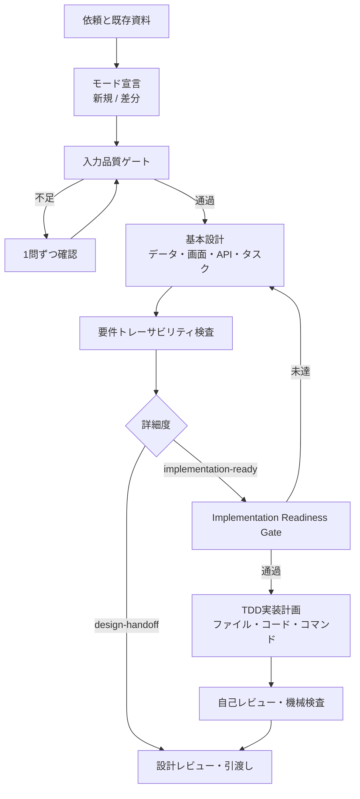

# `basic-design` 改善提案書

## 1. 提案の結論

`basic-design` は、要件を設計へ漏れなく変換する力が強く、`superpowers:writing-plans` は、設計を実装者が迷わない作業へ分解する力が強い。両者は競合ではなく、次のように接続するのが最も効果的である。

> `basic-design` を「設計の正しさを作るスキル」から「設計の正しさを作り、必要に応じて実行可能な計画へ引き渡すスキル」へ拡張する。

ただし、`writing-plans` の詳細度を常に基本設計へ持ち込むと成果物が過大になる。本案件では基本設計一式が約1,300行、実装計画だけでも約1,300行になった。この結果から、基本設計と実装計画は別成果物に保ち、利用目的に応じて詳細度を切り替える方式を推奨する。

## 2. 比較対象

- 自作 `basic-design`
- `superpowers:writing-plans`
- 改善方法の評価基準として `skill-creator`
- 実案件: あとキュー（仮称）MVP

実案件では、先に要件IDを持つ要件基準書を作り、`basic-design` でデータ・画面・API・タスク設計へ展開し、`writing-plans` で正確なファイル、テスト、コマンド、コミット単位まで具体化した。

## 3. 比較結果

| 観点             | `basic-design`                                   | `writing-plans`                                | 良いとこどりの方針                       |
| ---------------- | ------------------------------------------------ | ---------------------------------------------- | ---------------------------------------- |
| 入力品質         | 要件ID、入力品質ゲート、質問で不足を補える       | 設計済み前提が強い                             | `basic-design` を入口にする              |
| 開発モード       | 新規・差分を区別できる                           | 明示的なモードがない                           | 現行を維持する                           |
| 確定度管理       | 確定・【想定】・【要確認】・【失効】を区別できる | 実装前提を断定しやすい                         | 計画にも同じ状態を継承する               |
| 設計範囲         | データ、画面、API、タスク、サマリを横断する      | 主に実装作業の順序と詳細                       | 設計成果物は現行を維持する               |
| トレーサビリティ | 要件IDから設計・タスクを追える                   | タスクごとの要件対応は既定で必須ではない       | 全タスクに要件IDを必須化する             |
| 実装可能性       | `docs/tasks.md` は比較的大きな作業単位           | 正確なファイル、関数、テスト、コマンドまで指定 | オプションで実行計画を生成する           |
| テスト先行       | DoD・検証はある                                  | RED→GREEN→検証を各タスクで強制                 | 実行計画モードではTDDを必須化する        |
| 実行結果         | 検証方法は書ける                                 | コマンドと期待結果を明記する                   | DoDにコマンドと期待結果を追加する        |
| コミット         | 明示的でない                                     | 小さなコミットを各タスク末尾に置く             | Git環境のときだけ必須化する              |
| 自己レビュー     | 成果物確認はある                                 | 要件漏れ、仮置き、型整合などを最後に再点検     | 機械検査と意味検査の二層にする           |
| 実装への引渡し   | AI入口ファイルを作れる                           | 実行スキルへの明確な引渡しがある               | `AGENTS.md` と実行計画を接続する         |
| スキル保守       | テンプレートと質問集を分離している               | 手順が比較的単目的                             | さらに参照資料と検証スクリプトへ分割する |

## 4. 維持すべき `basic-design` の強み

以下は変更せず、改訂版の中核として残す。

1. 新規開発モードと差分開発モードの宣言
2. 要件定義書と要件IDを前提にする入力品質ゲート
3. 確定、【想定】、【要確認】、【失効】の状態管理
4. 一度に大量質問せず、意思決定が必要な点を絞る進行
5. データ、画面、API、タスク、基本設計サマリの成果物分離
6. 要件IDから設計とタスクへのトレーサビリティ
7. Codex向け `AGENTS.md` など、利用AIに応じた入口ファイル
8. 既存構造を尊重する差分設計

これらは `writing-plans` 単独では補いにくく、`basic-design` の独自価値である。

## 5. 改善すべき点

### P0: 次版で必ず入れる

#### 5.1 設計詳細度を明示する

開始時に次のどちらかを宣言する。

| モード                 | 出力                              | 用途                       |
| ---------------------- | --------------------------------- | -------------------------- |
| `design-handoff`       | 現行の基本設計一式 + 粗粒度タスク | 見積、合意、別チーム引渡し |
| `implementation-ready` | 上記 + 詳細実装計画               | 直後にAIまたは開発者が実装 |

推奨既定値は `design-handoff`。ユーザーが「このまま実装したい」「実装計画もほしい」と述べた場合だけ `implementation-ready` を選ぶ。

#### 5.2 Implementation Readiness Gateを追加する

詳細実装計画へ進む前に、次をすべて判定する。

- 要件IDに抜けと重複がない
- 必須要件に設計先と検証先がある
- 主要データ型、状態遷移、API境界が定義済み
- 技術スタックが確定または【想定】として明示済み
- 実行環境、配置形態、永続化方式が確定または【要確認】
- プライバシー・セキュリティ境界が定義済み
- 未決事項が実装順序を変えない、または計画内の停止条件になっている

未達なら、詳細計画を断定的に書かず基本設計へ戻る。

#### 5.3 実装計画テンプレートを追加する

`implementation-ready` の各タスクに次を必須化する。

```markdown
## Task N: <成果>

**Requirements:** F-xxx, NF-xxx

**Files:**

- Create: `exact/path`
- Modify: `exact/path:line`
- Test: `exact/test/path`

1. 失敗するテストを書く
2. コマンドを実行し、期待する失敗を確認する
3. 最小実装を行う
4. コマンドを実行し、期待する成功を確認する
5. 関連検証を実行する
6. Git管理下なら小さくコミットする
```

「APIを実装する」「テストを追加する」のような抽象タスクだけで完了させない。

#### 5.4 最終自己レビューを必須化する

最低限、以下を確認する。

- 全必須要件に設計・タスク・検証があるか
- 要件にない機能を混入していないか
- 【想定】を確定事項として扱っていないか
- 同じ型、列名、状態名、APIパス、エラーコードが文書間で一致するか
- TODO、TBD、XXX、仮のパス、仮のコマンドが残っていないか
- 主要な正常系、境界値、異常系、回復系がテストに含まれるか
- 実行コマンドと期待結果が具体的か
- AI入口ファイルと詳細計画の参照先が一致するか

#### 5.5 設計と計画の型整合性を検査する

本案件では、計画内のテスト呼び出しと関数シグネチャで引数数の不一致が一度見つかった。文書でも型・関数の整合性レビューが必要である。

推奨ルール:

- 同じ名前の型・関数は1つの正典ファイルで定義する
- 計画中のコード例は正典のシグネチャを参照する
- コード例の識別子を機械抽出し、同名シグネチャの不一致を警告する
- APIリクエスト例を契約スキーマのテストfixtureとして再利用する

### P1: 次版で強く推奨

#### 5.6 `SKILL.md` をルーター化する

`skill-creator` の原則に合わせ、`SKILL.md` はワークフロー、判断基準、必須ルールだけに絞る。詳細は必要時に読む参照ファイルへ移す。

推奨構成:

```text
basic-design/
├── SKILL.md
├── references/
│   ├── input-quality-gate.md
│   ├── design-template.md
│   ├── question-bank.md
│   ├── status-and-modes.md
│   ├── implementation-plan-template.md
│   ├── self-review-checklist.md
│   └── examples/
│       ├── new-development.md
│       └── incremental-change.md
└── scripts/
    ├── validate_design_bundle.py
    └── validate_traceability.py
```

`SKILL.md` には「どの参照をいつ読むか」を明記する。すべてを常時読み込ませない。

#### 5.7 自動検証スクリプトを追加する

`validate_design_bundle.py`:

- 必須成果物の存在
- 空ファイル
- TODO/TBD/XXX
- 【要確認】一覧の有無
- API設計が必要なのに欠落していないか
- 新規/差分モードの宣言

`validate_traceability.py`:

- 要件IDの抜け・重複
- 要件→設計→タスク→検証の逆参照
- 未知の要件ID参照
- 必須要件にDoDがない状態
- 【失効】要件を実装タスクが参照する状態

スクリプトはエラーを0/1の終了コードで返し、人間向け一覧も出力する。

#### 5.8 リポジトリ調査と技術鮮度確認を工程化する

詳細計画の前に次を確認する。

- 実在するディレクトリ、パッケージ、テストコマンド
- Gitの有無と作業ツリー状態
- 既存のAIガイド、規約、CI、環境変数
- ランタイムと主要ライブラリの対応バージョン
- ブラウザ、OS、クラウドなど変更しやすい制約の一次情報

新規リポジトリでは予定パス、既存リポジトリでは実在パスを使用し、両者を混同しない。

#### 5.9 非機能要件を「検証方法」へ変換する

非機能要件を文章で終わらせず、次のいずれかへ割り当てる。

- 自動テスト
- 性能計測
- セキュリティ検査
- アクセシビリティ検査
- ブラウザ・端末の手動確認
- 運用訓練

手動確認には担当、環境、記録形式、合否条件を持たせる。

### P2: 運用しながら追加

#### 5.10 設計品質スコアを導入する

100点満点の例:

- 要件カバレッジ: 25
- 状態・データ整合性: 15
- UI/API境界: 15
- 非機能の検証可能性: 15
- 実装計画の再現性: 15
- 未決事項の管理: 10
- 文書間整合性: 5

点数だけで合否を決めず、欠落の所在を示す診断として使う。

#### 5.11 良い例と悪い例を短く持つ

- 粗すぎるタスクと適切なタスク
- 確定事項と【想定】の混同
- 要件IDはあるが検証先がない例
- APIパスや型名が文書間でずれる例
- 差分開発で既存仕様を上書きしてしまう例

長い完成サンプルより、判断が分かれる箇所の対比例を優先する。

## 6. 推奨ワークフロー



## 7. `SKILL.md` への具体的な追記案

### 7.1 冒頭の目的

```markdown
このスキルは、要件IDを持つ要件定義を、実装可能な基本設計へ変換する。
ユーザーが直後の実装も求める場合は、Implementation Readiness Gateを通過後、
正確なファイル・テスト・コマンドを持つ実装計画を別成果物として生成する。
```

### 7.2 開始時宣言

```markdown
開始時に必ず次を宣言する。

- 開発モード: `new` / `incremental`
- 計画詳細度: `design-handoff` / `implementation-ready`
- 要件基準書
- 既存リポジトリの有無
- 未確認の技術前提
```

### 7.3 実装計画への分岐

```markdown
`implementation-ready` の場合のみ、基本設計完成後に
`references/implementation-plan-template.md` を読み、別ファイルへ計画を書く。
基本設計サマリや `docs/tasks.md` を巨大な実装手順で置き換えない。
```

### 7.4 完了条件

```markdown
完了報告前に、次を必ず実行する。

1. 必須成果物検査
2. 要件IDの抜け・重複・未知参照検査
3. 必須要件の設計・タスク・検証カバレッジ検査
4. TODO/TBD/XXXと未分類の仮定検査
5. 型名・状態名・APIパス・エラーコード・コマンドの整合性レビュー
6. `implementation-ready` では各タスクのRED/GREEN/検証/コミット確認
```

## 8. 本案件で確認できた効果

### `basic-design` が効いた点

- F-001〜F-018、NF-001〜NF-013をデータ・画面・API・タスクへ漏れなく配置できた
- PWAの制約を理由に通知サーバーを追加しても、タスク本文を端末外へ出さない境界を維持できた
- 「今日の確認」の中央タイトル、`← 前のタスク`、全件後の修正など、会話で確定した細部を画面設計へ固定できた
- 期限未設定、期限超過、放置レベルを状態と履歴へ分解できた

### `writing-plans` が効いた点

- monorepoのパス、パッケージ境界、関数シグネチャ、API契約を具体化できた
- 各機能を、失敗テスト→最小実装→成功確認→コミットへ変換できた
- 通知本文漏えい、未知スキーマ、破損、オフライン、Push失効など、回復系のテストが明確になった
- 最終レビューで、テスト例と関数シグネチャの引数不一致を実際に検出・修正できた

### 組み合わせで見えた注意点

- 技術スタックが未確定のまま詳細計画へ進むと、設計上の【想定】が実装上の確定事項に見えやすい
- 詳細計画は大きくなるため、基本設計サマリや粗粒度タスクと分離する必要がある
- 小刻みなコミット指示はGit管理下で有効だが、Gitがない場合は初期化の権限と方針を先に確認する必要がある
- 新規開発の予定パスと、既存開発の実在パスを区別する必要がある

## 9. 改訂版の受入条件

改訂した `basic-design` は、次を満たせば改善完了と判断できる。

1. `design-handoff` と `implementation-ready` の両方を例題で実行できる
2. 新規・差分の両モードで既存要件を失わない
3. 要件IDの抜け・重複・未知参照を検出できる
4. 必須要件に設計、タスク、検証がない場合に失敗できる
5. 詳細計画の全タスクに正確なファイル、テスト、コマンド、期待結果がある
6. 【想定】と【要確認】が確定事項へ無断昇格しない
7. APIパス、型名、状態名の不一致をレビューで検出できる
8. `SKILL.md` が判断と手順に集中し、詳細テンプレートは参照ファイルへ分離されている
9. スキル検証ツールが成功する
10. 元の設計成果物の品質を落とさず、実装引渡しだけを強化できる

## 10. 推奨する改訂順序

1. 現行スキルを複製し、改訂用ブランチまたは別ディレクトリを作る
2. P0の「詳細度」「Readiness Gate」「実装計画」「自己レビュー」を追加する
3. 長い説明を `references/` へ移し、`SKILL.md` をルーター化する
4. 検証スクリプトを追加する
5. 小さな新規開発例と差分開発例で試す
6. 現行版と同じ入力で成果物を比較する
7. 誤検知・質問数・成果物量を調整する
8. 問題がなければ利用先の複数コピーを同じ版へ更新する

この順序なら、現行の強みを保ちながら実装可能性だけを段階的に高められる。実スキルファイルの変更は、本提案の承認後に別作業として行うのが安全である。
