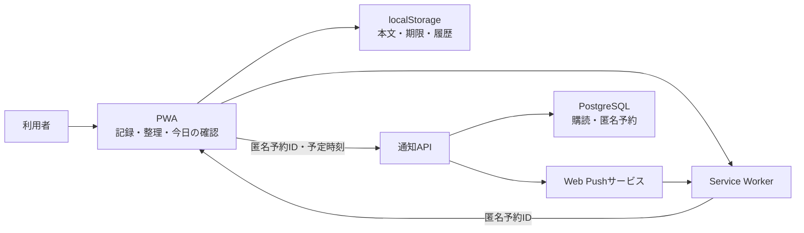

# あとキュー（仮称）基本設計サマリ

## 1. 結論

MVPは、スマホとPCにインストールできるPWAとして構築する。思いついた瞬間は一文だけを端末内へ保存し、後から受信箱でタスク候補を確定する。「今日の確認」では対象を1件ずつ提示し、放置度合いに応じた声掛けから、完了・期限変更・期限なし・見送り・アーカイブのいずれかへ導く。

PWA単体では閉じている間の正確な定期実行を保証できないため、Web Push用の最小バックエンドを併設する。バックエンドはタスク本文を持たず、匿名通知予約だけを保存する。通知が届かない場合も、PWA起動時に端末内データから同じ確認対象を再計算する。

## 2. 設計モード

- 新規開発
- 要件基準書: `docs/requirements.md`
- 確定事項は無印、設計上の仮置きは【想定】、意思決定が必要なものは【要確認】で統一

## 3. 全体構成

サーバーへ送らない情報:

- タスク・メモ本文
- カテゴリ
- タスク期限という意味
- 完了・アーカイブ・不要などの状態
- 操作履歴

## 4. 主要フロー

### 4.1 記録

1. PWAを開く。
2. 一文を入力する。
3. 「保存して戻る」で端末内へ保存する。
4. 期限・カテゴリは聞かず、元の作業へ戻れる。

保存操作の右側は「改行で登録」と現在のバージョンを縦に並べ、バージョンは操作より小さい緑灰色の文字で控えめに表示する。

全画面の「あとキュー」と同じ行に、対応中の期限超過件数と期限超過一覧への小さな導線を置く。記録画面は既存の段落余白を調整してページ高を増やさず、入力・保存を優先する。期限超過は時計アイコンと橙系の補助色で統一し、完了・アーカイブ後は端末内保存に連動して件数・強調を即時更新する。見送りは期限超過の解消ではないため件数に残す。表示中30秒ごとと前面復帰でも再計算するが、通知頻度・確認履歴・保存形式は変更しない。

共通ヘッダ行と期限超過案内は標準表示で28px、ヘッダ下の余白は4pxとする。0件で案内を隠してもヘッダ行の高さは維持する。「あとキュー」は本文左端から4px右、案内は右揃えの位置から4px左へ寄せる。案内の押下領域だけを上側の既存余白へ16px拡張し、見た目や本文位置を変えず44pxの操作範囲を保つ。

### 4.2 整理

1. 受信箱の `未整理 / メモ / 不要` で、タスク化前の記録を新しい順に確認する。各タブには現在件数を表示する。
2. 未整理の記録からタスク候補、メモ、不要を選ぶ。不要にした記録は個別または一括で未整理へ戻すか、確認後に完全削除できる。
3. タスク候補は利用者が明示的に確定する。タスク化後の元記録は受信箱から除外し、タスク一覧と詳細で扱う。
4. 期限を決めない場合は3日後に再確認し、3回続けば週次確認へ移す。期限を決める場合は日付と任意の時刻を指定でき、時刻を指定しないときは設定の既定期限時刻（初期値23:59）とする。

### 4.3 今日の確認

1. 期限超過、当日期限、期限未設定、再確認時刻到来を並べる。
2. 1件ずつ声掛け・タスク名・設定済みカテゴリ・処理ボタンを表示する。
3. ボタン選択で次のタスクへ進む。
4. 2件目以降は見出し右側の `前のタスク` で直前へ戻って修正できる。
5. 全件終了後も結果画面、タスク一覧、詳細から能動的に修正できる。タスク一覧は設定済みカテゴリをチップで示し、詳細概要は未設定の `なし` を含めてカテゴリを常時表示する。

## 5. 放置への声掛け

放置レベルは端末時刻、期限、見送り回数、期限未設定の再確認回数から導出する。OS通知を閉じた回数は取得できないため使わない。

| レベル | 方針                                 |
| ------ | ------------------------------------ |
| 0      | 軽く予定を聞く                       |
| 1      | 次に動ける日を決める                 |
| 2      | 今日実行か日付変更へ絞る             |
| 3      | 残すか判断するよう促す               |
| 4      | 完了・新期限・アーカイブの決着を促す |

責める表現は避け、放置が進むほど選択肢を具体化する。

## 6. 今日の確認のUI決定

- 1画面1件
- 選択後は即時に次へ進み、二段階確認は行わない
- 見出しは他画面と同じ左揃えとし、2件目以降だけ右側に矢印なしの `前のタスク` を置く
- 進行件数はタスクカード内の右上に表示する
- 手動の `前のタスク` / `次のタスク` は当日の確認リストを順に表示する。完了・アーカイブ済みも飛ばさず、タスク画面から処理した場合も同じ位置で閲覧・修正できる。`次のタスク` は末尾から先頭へ巡回する
- 回答直後の自動移動は未回答の対応中Taskを優先し、手動の履歴閲覧とは分離する。ページ番号・カード内容・操作対象は必ず一致させる
- 中断した確認を再開するとき、保存位置が完了・アーカイブ済みなら次の未回答タスクから再開する
- 結果画面から処理内容を修正可能
- トースト型Undoは設けない

## 7. データ設計

端末内は `AppSnapshot` を `localStorage` へ一括保存する。キャプチャ、タスク、今日の確認セッション、操作履歴、通知送信待ち、匿名通知ID対応を含む。入力途中の下書きだけ別キーとする。

期限超過と放置レベルは保存せず再計算する。期限の入力は端末のIANAタイムゾーンで解釈し、保存はUTC、表示は端末ローカル時刻とする。データ形式には `schemaVersion` を持たせ、未知版や破損時に上書きしない。JSONバックアップにはPush秘密値や通知購読を含めない。

## 8. API設計

主要API:

- Push公開鍵取得
- 匿名端末登録・購読更新・無効化
- 匿名通知予約の作成・更新・取消
- ヘルスチェック

予約APIに `title`、`body`、`taskId`、`category` が含まれた場合は400で拒否し、本文漏えいをテスト可能にする。Push payloadは匿名 `reminderId` と遷移先だけを含む。

期限超過タスクの再通知は端末設定で `再通知しない / ゆっくり確認する / こまめに確認する` を選ぶ。ゆっくりは期限の1・3・7日後から週次、こまめは4時間後から毎日期限時刻に、タスクごとの匿名予約として配送する。完了・アーカイブでは全予約を取消し、期限なしでは期限関連予約を通常の週次見直しへ置換し、期限変更では旧予約を新期限からの予約へ置換する。今回は閉じるでは系列を維持する。端末内の本文、タスクID、期限内容は通知サーバーへ送らない。

## 9. 技術スタック

実装着手時の【想定】:

- pnpm monorepo、TypeScript、Node.js 24 LTS
- React 19.2、Vite 8、PWA
- Fastify 5、PostgreSQL、Web Push
- Vitest、React Testing Library、Playwright
- GitHub Pagesから `https://atoqueue.sikumilab.com` を配信し、OCI VPS上の常時稼働APIを利用する

通知APIは構築済みOCI VPSへ配置し、既存PostgreSQLの専用DB `atoqueue_notify` を利用する。専用ロールは `atoqueue_notify_app`、スキーマは既定 `public`（【想定】）とする。Fastifyは `systemd` の単一サービスとして `127.0.0.1:3030` で待受し、Caddyが `https://api.atoqueue.sikumilab.com` のHTTPS終端とリバースプロキシを担う。DB接続はlocalhostまたはUnix socketを優先する。Cloudflare DNSはPWA・APIとも最初はDNSのみ（プロキシなし）とする。

## 10. 品質と運用

- オフラインでも記録・整理・確認を継続できる。
- 通知更新はOutboxへ保持し、オンライン復帰時に再送する。
- 通知配送失敗でもローカル状態は失わない。
- 【確定】通知設定では未整理の記録に対する初回通知（初期60分後）と、タスクの期限前通知（初期60分前）を設定できる。未整理とメモは各一覧で最古の残件を基準にした匿名リマインド系列を持ち、分類・復元・完全削除のたびに残件に合わせて取消・再作成する。新しい未整理記録の追加だけでは、通知APIへ同期済みの既存受信箱・メモ系列を取消・再作成せず、予約時刻を維持する。初めての未整理記録なら受信箱の初回通知だけを設定時間後に追加する。初回通知前にタスク化した記録は受信箱系列から外し、タスク用の初回通知は作り直さない。タスクには期限前と通常の再確認予約だけを作り、完了・アーカイブ時はそのタスクの匿名予約を全て取消す。
- 【確定】通知タイミングと確認頻度の保存は端末内永続化の完了時点で操作を再開可能にし、通知Outbox同期は結果表示を分けてバックグラウンドで継続する。
- 【確定】配送サーバーは5分間隔で稼働し、`DEADLINE_DELIVERY_LEAD_SECONDS`（初期300秒）の先読みで期限前配送を試行する。OS・通信の事情により正確な時刻到達は保証しない。
- 【確定】同じ通知種別・同じ予定時刻の予約は匿名グループIDで一つのOS通知へ集約し、異なる種別または時刻は別通知として新しく知らせる。グループIDにタスク本文・局所ID・期限内容を含めない。
- 【確定】Pushサービスには高優先度と24時間の保持を要求し、Service Workerは対応端末へ短い振動を要求する。`silent` や常駐表示は強制せず、端末のサイレント／おやすみモードと利用者の通知設定を優先する。
- 【確定】設定画面に端末のタイムゾーンとUTCオフセット、最大5分の配送確認周期、スマートフォンで通知が届かないときの確認項目を表示する。
- 【確定】期限日だけを指定する場合は、端末内の設定 `defaultDeadlineTime` を使う。初期値は23:59で、日付は8桁・時刻は4桁の手入力とOSピッカーを併用する。時刻の入力は明示的な有効化時だけ使う。
- 【確定】設定画面は通知を先頭に置く。端末データ削除は二段階確認を必須とし、サーバー側の匿名Push端末登録を停止できた場合に、この端末の記録・タスク・設定・下書きを削除する。通信失敗時は端末データを保持して再試行できるようにする。
- 【確定】初回の記録画面では、通知タイミング、端末通知の設定場所、記録を受信箱でタスク化できることを案内する。通知許可の要求は案内中に自動実行しない。
- 【確定】画面全体はKosugiを基本書体とし、スマートフォンのフローティングフッタを含む各画面のカード・入力欄・操作色を設定画面のトーンへ統一する。ナビゲーション記号は太いSVG線で表示する。
- JSONバックアップ、破損退避、スキーマ移行を設計する。
- タスク本文がAPI、DB、ログ、Push payloadへ出ない契約テストを置く。
- iOS Home Screen PWA、Android Chrome、PC Chrome/Edgeで実機確認する。iOS/iPadOSは端末寸法別の静的起動画面を配信し、ホーム画面起動時に既存アイコンを表示する。
- 配送処理は5分ごとに期限到来予約を取得し、5分・15分・60分後の再試行を最大3回行う。15分を超える処理中予約は起動時に回復する。
- 通知DBのOCI Object Storage連携・定期バックアップはMVP対象外とする。DB消失時は端末登録と有効予約を再同期する。
- 本番配置はGitHub Actionsの手動実行と承認を必須とし、専用配置ユーザー `atoqueue-deploy` と専用SSH鍵を使う。

## 11. MVP範囲外

- アカウント
- 端末間同期
- クラウドへのタスク本文保存
- 生成AI分類
- チーム共有
- 外部カレンダー連携
- 音声入力、位置情報通知

将来同期へ進む場合は、localStorageリポジトリ境界をIndexedDBと同期APIへ差し替える。端末内ID、更新版、操作履歴はその移行を考慮している。

## 12. 主な【要確認】

1. 正式名称と通知に表示するアプリ名
2. 「今週中」を日曜23:59、週次確認を日曜18:00とする初期値
3. 一文の上限280文字
4. 「アーカイブ」を確認なしで即時実行する操作
5. 7日間試用の合格基準

## 13. 詳細文書

- `docs/requirements.md`: 要件基準書
- `docs/data-model.md`: 端末・サーバーのデータ設計
- `docs/screens.md`: 画面、遷移、文言、受入シナリオ
- `docs/api-design.md`: 通知API、認証、配送、エラー
- `docs/tasks.md`: タスク、依存、DoD、要件カバレッジ
- `docs/superpowers/plans/2026-08-03-atoqueue-mvp.md`: TDD実装計画

## 14. 通知予約の再送安定化（2026-08-31）

F-014: 全体通知の系列識別情報は端末内に保持し、送信待ちから消えた予約も登録済みとして維持する。同じ操作の再送は時刻経過後もサーバーで冪等に受け付け、送信済み予約を復活させない。再計算で過去の通知を現在時刻へ作り直さず、明示的な通知再設定では受信箱・メモ両系列を復旧する。保存形式はv10、通知APIの送信項目・DB形式・通知頻度の設定値は変更しない。
